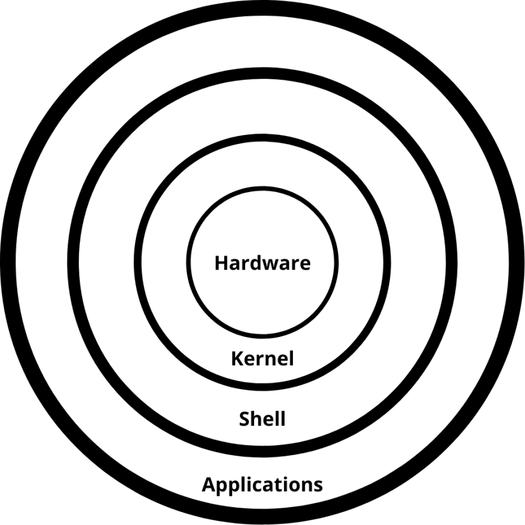

- Linux Distribuitions
    -
    Distritribuition is also called as flavoures and virsions

    - 1 Ubuntu
    - 2 Kali Linux
    - 3 Dabian
    - 4 Linux mint
    - 5 Fedora

    - All of the distribuition having the same  'Kernel'

- Differance btn 

WindowsOS ----- UnixOS -----     Linux

- WindowsOS
    - proprietry Based (Means it having only user/Owner of the OS)
    - Paid (You have to purchase windows OS to use it)
    - 80% Desktop Based ( it want its own hardware components )
    - Heavy Weght ( It requires more H/W components like storage & RAM )
    - Microlithic ( its Divided in various parts ,if the one bug is in that perticular part will get the errors after all everything will work)
    - GUI Oriented ( there is animations icons enterface but it also having CLI )

- UnixOS
    - proprietry Based (Means it having only user/Owner of the OS)
    - Paid (You have to purchase Unix OS to use it)
    - 90% Server Based ( )
    - Light Weight ( It requires less H/W componants)
    - Monolithic ( its in single part, like if there is error the evrything will stop )
    - CLI oriented ( mostly persforms action text/command based but minumum GUI)
    
- LinuxOS
    - Community Based ( It can have multiple owner/users)
    - Free (their is no requirment to purchase it free )
    - 90% sever based ( )
    - Light weight (It requires less H/W componants momory storage)
    - Monolithic ( it perform Action in single part like if there is error the evrything will stop )
    - CLI oriented ( mostly persforms action text/command based but minumum GUI)

- Architecture Of OS
    - 
    
    ( ( ( (    H/W ) Kernel) Shell) Application) User

    - Applications
        - application is nothing but ' Set of instruction/programs Which are designed for spacific purpose '

    - Shell
        - Shell means the plateform the isolated plateform to get input from users
        - Every application have their own shell
        - Types of shell
            - 1 Graphical shell
                - 2 Commandline shell
                - Bash - Default in linux
                - k
                - sh

    - Kernel
        - Kernel is heart of operating system
        - Its manages the required hardware components ( CPU, storage, RAM)
        - process management
            - get requirements from hardware and provide it to application 

